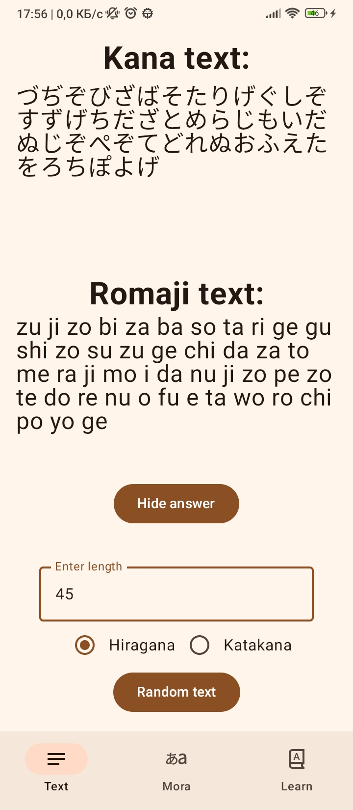
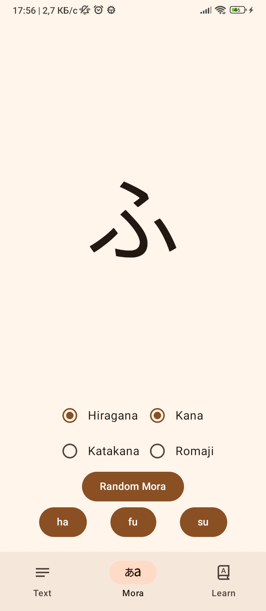
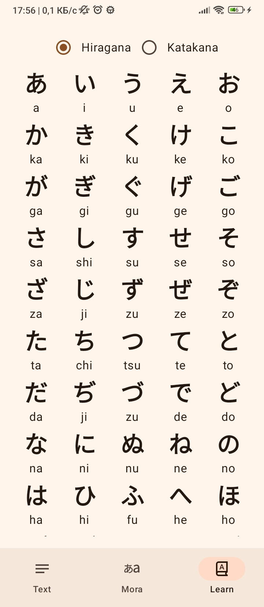

# KanaMemo

Mobile app that helps you memorise Japanese alphabets.

## Libraries

- Jetpack Compose
- Navigation
- ViewModel
- TextToSpeech

## Result

|  |  | 
|----------|:-------------:|:-------------:|
